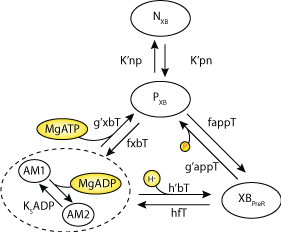

Computational code to reproduce simulation figures in the J. Physiol publication: "Experimental and modelling evidence of shortening heat in cardiac muscle."
DOI: `10.1113/JP274680 <https://dx.doi.org/10.1113/JP274680>`_

   Schematic of cross-bridge model.

   
Main.m
------
This script sets up and executes the model simulations in the presence of passive force. Run this code to simulate Figures 3, 4, 7 and 8.
 
PlotFigures.m
-------------
After Main.m has been executed, run this script to plot Figures 3, 4, 7 and 8.

Main_noPassive.m
----------------
This script sets up and executes the model simulations in the absence of passive force. Run this code to simulate Figures 6 and 7.

PlotFigures_noPassive.m
-----------------------
After Main_noPassive.m has been executed, run this script to plot Figures 6 and 7.

XBSolve.m
---------
A function that contains the algoritms for setting up isometric and work-loop contractions. This function is called by Main.m and Main_noPassive.m.

XBModel.m
---------
This function returns the RHS vector of the `Tran et al., (2010) model of cross-bridge cycling <https://models.physiomeproject.org/workspace/tran_2009>`_.  

getDeriv.m
----------
This function calls XBModel.m to setup the RHS vector. It is also called after completion of a solve to return the Force and ATPase information.

getCai.m
--------
This function returns a Ca transient.

passiveForces.m
---------------
This function returns the passive force.

IC_XBModel.m
------------
This script file contains the initial parameters of the cross-bridge model.

Parameters_XBModel.m
--------------------
This script contains the parameters for the cross-bridge model.

Fevents.m
---------
This function is used to detect when the isotonic phase of the work-loop starts. It is used in the work-loop section of XBSolve.m when the ode15s solver is called.  The Fevents function is setup using the 'options' argument of the solver on line 36.