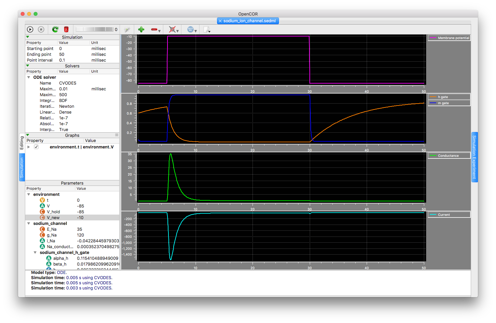
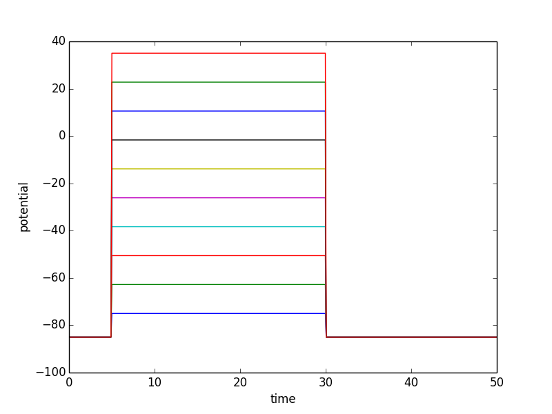
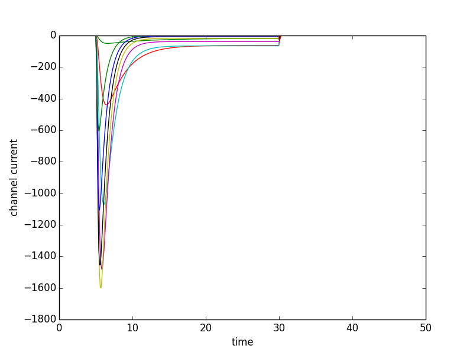
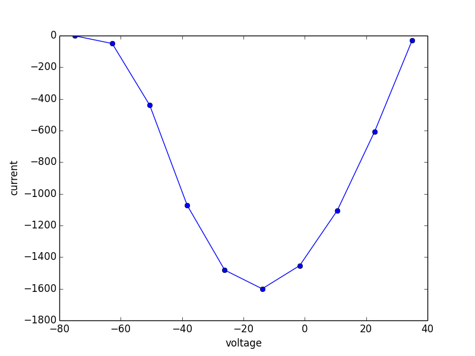

The HH sodium channel
---------------------

In the `OpenCOR tutorial <http://tutorial-on-cellml-opencor-and-pmr.readthedocs.io/>`_, the Hodgkin & Huxley sodium channel is used as the example illustrating the core concepts of encapsulation and interfaces in CellML. It is also a great example demonstrating the utility of `providing SED-ML alongside the model <sodium_ion_channel.sedml>`__, as shown with the results presented in the figure below.

   
   A screenshot illustrating the results when the associated SED-ML document is loaded into OpenCOR and the simulation executed. This can be reproduced directly from the repository by choosing the **Launch with OpenCOR** link from the *Views Available* and having a recent (the 29 November snapshot release, or newer) version of OpenCOR installed.
   
This configuration of the simulation experiment is replicating a single voltage clamp, where the cell membrane potential is being held at a fixed value and then for a period of time the potential is held at a different value. This is shown for several different potential values in the figure below.

   
   Illustrative simulation results when executing this simulation experiment several times with different clamp potentials in the voltage clamp protocol.

When executing the above simulation experiments, the model predicts the current that would flow through this channel due to the change in the clamped potential. This can be seen in the following figure.

   
   Example sodium current results when executing this simulation experiment several times with different clamp potentials.

Voltage clamp simulation experiments like this one are often used in parameter estimation tasks. Experimentally, the current evoked when applying these kinds of voltage clamp prototols can be measured and the data used to fit the model dynamics. For example, looking at the peak current predicted by the model at varying clamp potentials may help parameterise the conductance of current model, as shown in the figure below.

   
   Example peak current predicted by the model for various clamp potentials.
