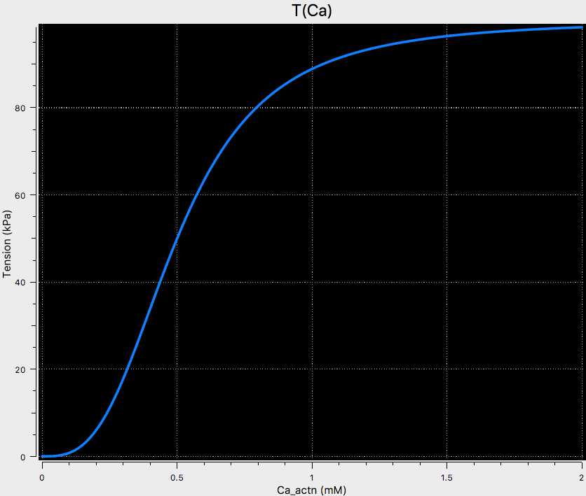

Steady state HMT
----------------

This is the steady state HMT model encoded in CellML. See `Nash 1998 <http://hdl.handle.net/2292/84>`_ for the original formulation, as well as the
original `HMT 1998 <https://www.ncbi.nlm.nih.gov/pubmed/9785944>`_ paper.

   
   A screenshot illustrating the results when the associated SED-ML document is loaded into OpenCOR and the simulation executed.
   This can be reproduced directly from the repository by choosing the **Launch with OpenCOR** link from the *Views Available* and 
   having a recent (the 29 November snapshot release, or newer) version of OpenCOR installed.
   
