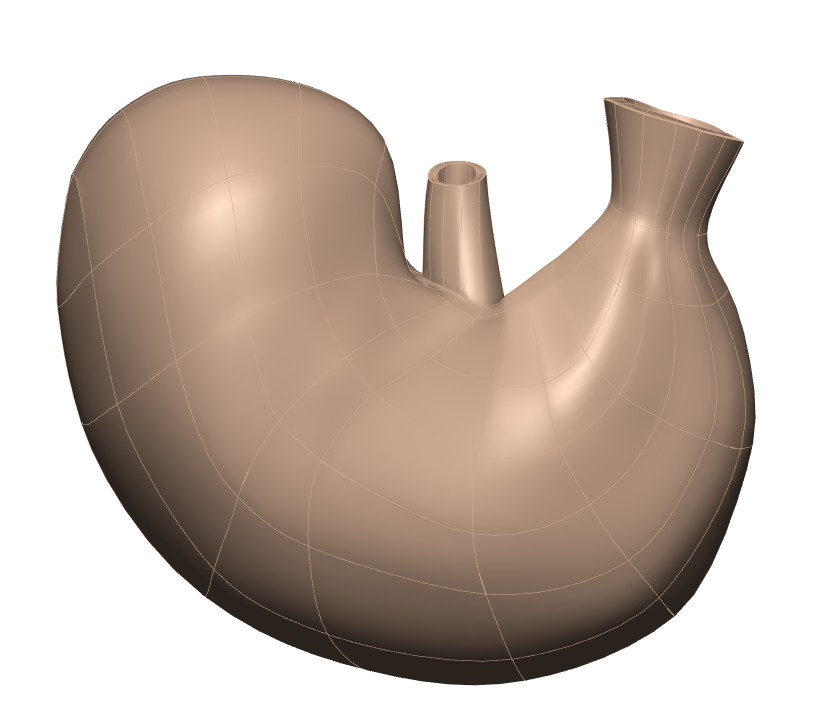

In this workspace we have the `Scaffold Maker <https://github.com/ABI-Software/scaffoldmaker>`_ workflow and configuration files needed to produce the generic rat stomach scaffold for the `SPARC <https://commonfund.nih.gov/sparc>`_ project. 

A statistically representative and anatomically-based 3D scaffold of the rat stomach is created to map nerve ending pathways. Micro-CT image data of 11 animals are used to construct this 3D scaffold. Imaging and data segmentation is performed at the Powley laboratory using Neurolucida (MBF Bioscience). An approximate surface is generated for each case using gross morphometric measurements of the organ. These surfaces are then fitted to the segmented data. The surfaces from the fitted scaffolds are combined to form an average stomach surface of representative thickness to generate the 3D scaffold, which includes anatomically-distinct layers of serosa, longitudinal muscle, myenteric nerve plexus, circular muscle, submucosa and mucosa.

Please see the `SPARC Portal <https://sparc.science>`_ for more details about the SPARC project.