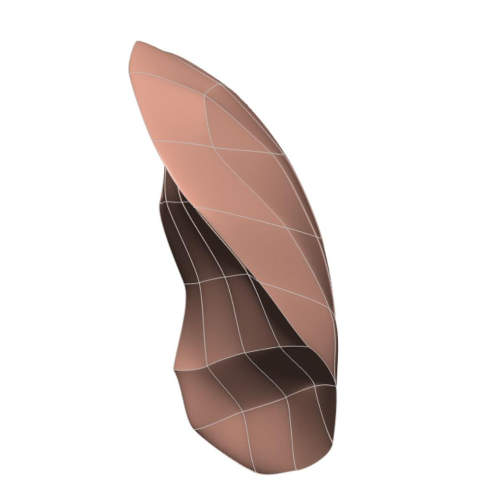

In this workspace we have the `Scaffold Maker <https://github.com/ABI-Software/scaffoldmaker>`_ workflow and configuration files needed to produce the mouse left lung scaffold for the `SPARC <https://commonfund.nih.gov/sparc>`_ project. 

The mouse left lung scaffold was created based on a generic structure containing different cube, wedge and tetrahedron elements. The scaffold was then fitted to the segmented dataset from (R. R. Beichel, R. W. Glenny, C. Bauer, M. A. Krueger, and W. J. Lamm: “Lung anatomy + particle deposition (lapd) mouse archive". University of Iowa, 2019.) to define the correct anatomy, with the derivatives being smoothed. The scaffold can now be used to register and map various data including neurons.

Please see the `SPARC Portal <https://sparc.science>`_ for more details about the SPARC project.
