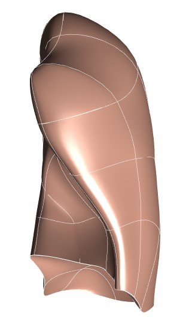

In this workspace we have the `Scaffold Maker <https://github.com/ABI-Software/scaffoldmaker>`_ workflow and configuration files needed to produce the human left lung scaffold for the `SPARC <https://commonfund.nih.gov/sparc>`_ project. 

The human left lung scaffold was designed based on the generic anatomical structure of the human lung with a number of elements. The scaffold is capable of representing the characteristics of an individual lung in humans. Particularly, this scaffold was fitted and smoothed to the segmented dataset from (Osanlouy, M., Clark, A. R., Kumar, H., King, C., Wilsher, M. L., Milne, D. G., ... Tawhai, M. H. (2020): 'Lung and fissure shape is associated with age in healthy never-smoking adults aged 20–90 years. Scientific Reports, 10 (1)') as shown in the thumbnail. The scaffold can also be used to register and map a broad range of data such as neural network, blood vessel, ventilation, etc.
