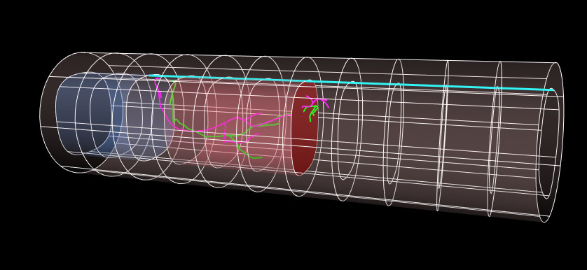
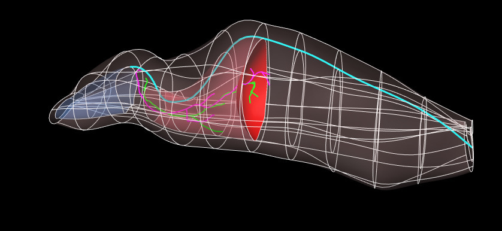

In this workspace we have the `Scaffold Maker <https://github.com/ABI-Software/scaffoldmaker>`_ workflow and configuration files needed to produce the rat whole body scaffold for the `SPARC <https://commonfund.nih.gov/sparc>`_ project. 

A generic solid cylinder mesh template has been created and forms the core of the whole body scaffold. Preliminary fitting to rat geometry has been performed. While the body coordinates field is laid out in the regular coordinates, the geometric coordinates field is fitted to the body of the animal of interest (rat here) including consistent positioning of interior layers such as between the core cavities and outside layers, at the diaphragm and at each organ fiducial point obtained from the image data. 

The central path used to generate the current rat whole-body scaffold is obtained from tracing a central path from SIMcore (Esra Neufeld) rat skin and diaphragm data. Synthetic data is obtained for the core boundary including a realistic path of the spinal cord.

Please see the `SPARC Portal <https://sparc.science>`_ for more details about the SPARC project.