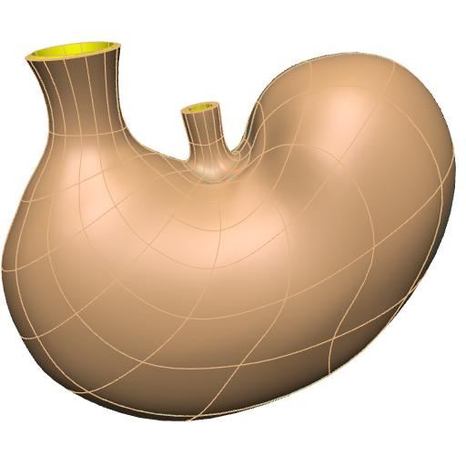

In this workspace we have the mapping tool provenance data file needed to produce the generic rat stomach scaffold for the `SPARC <https://commonfund.nih.gov/sparc>`_ project. The mapping tool will be accessible from the release download page on the `SPARC Portal <https://sparc.science>`_. 

An anatomically-based 3D scaffold of the rat stomach is created to map nerve ending pathways. The stomach scaffold is generated with a configurable central path defined from the fundus apex to the duodenum. A user can annotate the fundus, body, antrum, pylorus, and duodenum along the central path and use that to define the respective regions of the stomach. The cross axes of the central path provide control of the major and minor radii of the stomach in different sections. The rat stomach scaffold is parameterised with average data from segmentation of Micro-CT image data of 11 animals performed at the Powley laboratory using Neurolucida (MBF Bioscience).

In this release, the rat stomach scaffold has an improved fit with the average rat stomachs model. Four wall layers (mucosa, submucosa, circular muscle, and longitudinal muscle) are added to the rat stomach scaffold. The outer surface of the scaffold is annotated as the serosa.

Please see the `SPARC Portal <https://sparc.science>`_ for more details about the SPARC project.