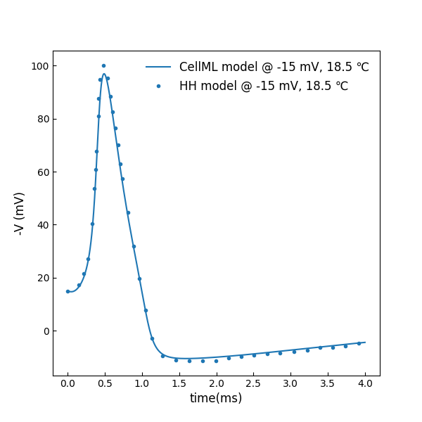
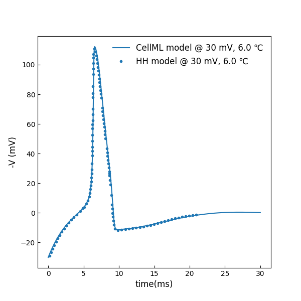

Periodic stimulation
--------------------------

In the `periodic stimulation experiment <../experiments/periodic-stimulus.cellml>`_, the `membrane potential model <../components/stimulated.cellml/view>`_ is configured and parameterised with an applied `periodic stimulus current <../experiments/periodic-IStim-protocol.cellml>`_. 

You can change the parameters of stimulation amplitude, duration and period in the component ``stimulus_protocol_params``. By default, the current is 0.

You can also modify the parameters of temperature :math:`T`, initial depolarization :math:`V_{initial}` and boundary condition of the potential :math:`V_b`, in the component ``parameters``, ``initial_conditions`` and ``boundary_conditions`` respectively.

The simulation experiment can be obtained by loading the `corresponding SED-ML document <../sed-ml/periodic-stimulus.sedml>`__ into OpenCOR and executing the simulation.

Membrane action potential
-------------------------

Figure [#]_ shows the action potentials with different initial displacement of membrane potential (The parameter setting is in the component ``initial_conditions``).

.. [#]

   Membrane potentials for initial depolarizations of -90, -15, -7 and -6 mV at 6 :math:`^{\circ} C` 

Subthreshold responses
----------------------

When the displacement of membrane potential is less than the threshold for setting up a spike, characteristic subthreshold responses are seen [#]_.

.. [#]

Responses to stimuli during positive phase
------------------------------------------

The depolarization stimulation can be applied at various times during the positive phases of the membrane action potential. Figure [#]_ shows the responses of the membrane when it is depolarized by -90 mv at :math:`t=0, 4.7284, 5.7302, 7.7352 s`

.. [#]

.. figure::  ../sed-ml/originalFig20.png
   :width: 85%
   :align: center
   :alt: originalFig20

Form of action potential at 18.5 :math:`^{\circ} C`
----------------------------------------------------

You can change the temperature T in the component ``parameters``.
Figure [#]_ shows the action potential at 18.5 :math:`^{\circ} C` with initial depolarization of -15 mV.

.. [#]

   Membrane potentials for initial depolarizations of -15 mV at 18.5 :math:`^{\circ} C`

Anode break excitation
----------------------
To simulate anode break responses where current is made to flow inward through the membrane, we set the initial potential value to be 30 mV. Meanwhile, the m, n and h gate have the steady state values for :math:`V=30 mV` when :math:`t=0`. That is, we set :math:`V_b=30` in the component ``boundary_conditions``. The simulation result is shown in Figure [#]_.

.. [#]

