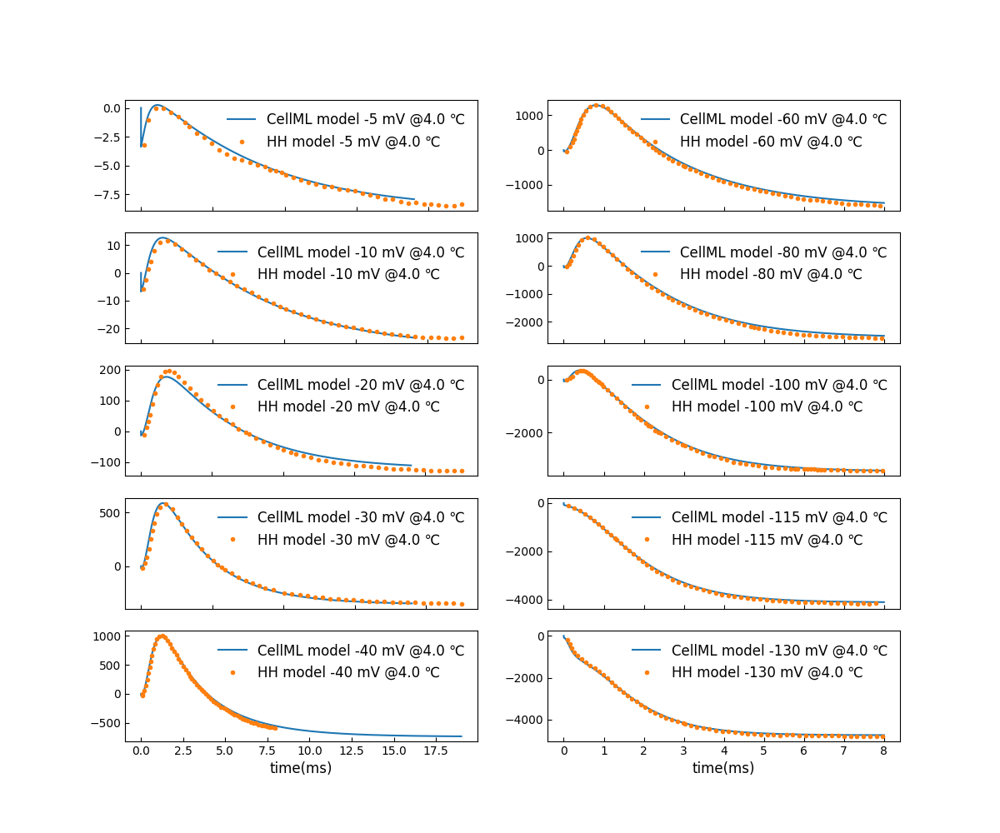

Voltage clamp experiment
----------------------------------------

In the `voltage clamp experiment <../experiments/voltage_clamp_experiment.cellml>`_,  the `membrane current model <../components/clamped_current.cellml/view>`_ is configured and parameterised to simulate the behaviour during a `voltage clamp <../experiments/voltage_clamp_protocol.cellml>`_.  

You can change the parameters of voltage clamp, such as start/end time and amplitude in the component ``voltage_clamp_protocol_params``. 

You can also modify the parameters of temperature :math:`T` and boundary condition of the potential :math:`V_b`, in the component ``parameters`` and ``boundary_conditions`` respectively.

The simulation experiment can be obtained by loading the `corresponding SED-ML document <../sed-ml/voltage_clamp_experiment.sedml>`__ into OpenCOR and executing the simulation.

Membrane currents during a voltage clamp
-----------------------------------------

Figure [#]_ shows the membrane current during a voltage clamp.

.. [#]

   Membrane current during voltage clamp at 4 :math:`^{\circ} C` 