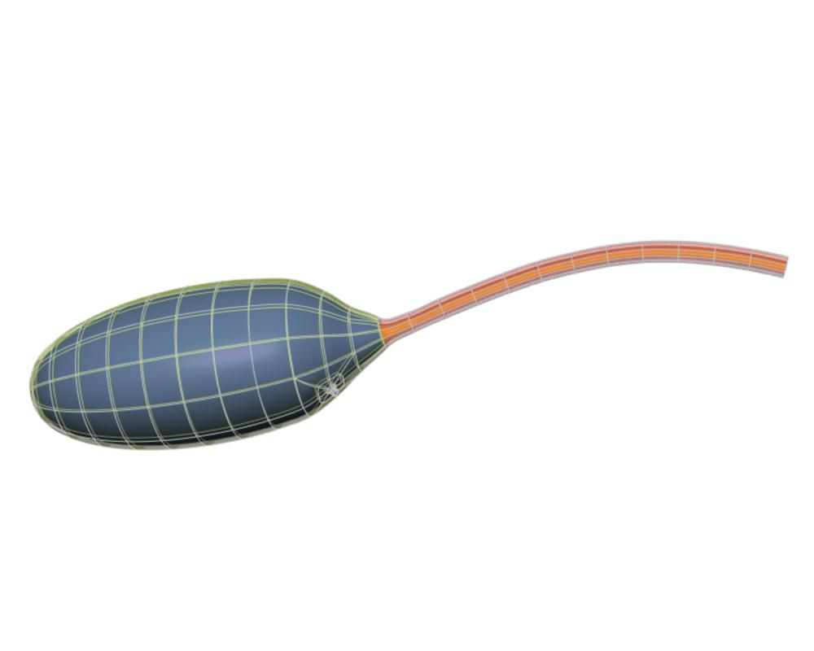

In this workspace we have the `Scaffold Maker <https://github.com/ABI-Software/scaffoldmaker>`_ workflow and configuration files needed to produce the generic cat bladder scaffold for the `SPARC <https://commonfund.nih.gov/sparc>`_ project. 

As with the other organ systems, the lower urinary tract (LUT) contains different sub-scaffolds consisting of the bladder, its ureters, and the urethra. The bladder scaffold consists of different tissue layers to represent the smooth muscles as well as the epithelial region. The smooth muscle layer transitions gradually into skeletal muscles as we move down the neck of the bladder into the urethra. The neck of the bladder is represented in the scaffold as a narrowing of the body at the region where ureters penetrate the surface into the lumen of the bladder. The scaffold has two different parameter sets for the rat and cat species, which are very similar in nature but have small, intricate differences. The parameters include the diameters for different axes, wall thickness, neck angle (for bladder only), etc., which are all defined for the bladder and urethra separately. Importantly, the entire scaffold is generated based on a central path defined by the user, which facilitates the initialization of the shape as well as annotation. The scaffold can now be used to register and map various data including neurons, or to define time-varying fields such as pressure or volume measured experimentally.

Please see the `SPARC Portal <https://sparc.science>`_ for more details about the SPARC project.