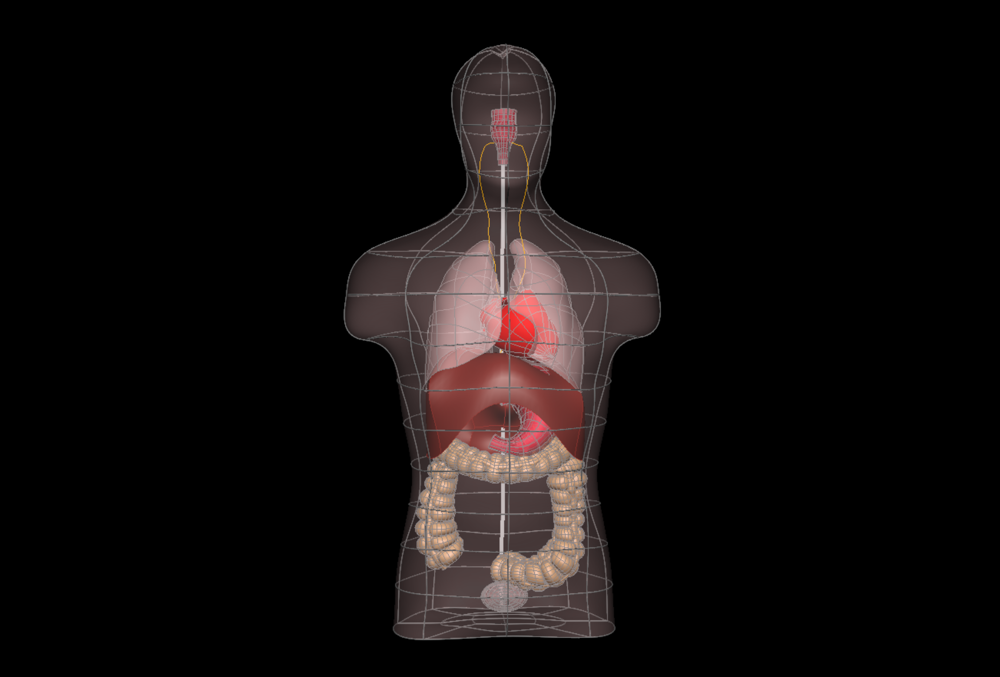

In this workspace, we have the workflow and configuration files needed to produce the human whole-body scaffold with embedded organs for the `SPARC <https://commonfund.nih.gov/sparc>`_ project. 

A generic solid cylinder mesh template has been created and forms the core of the whole-body scaffold. Preliminary fitting to human geometry has been performed. While the body coordinates field is laid out in the regular coordinates, the geometric coordinates field is fitted to the body of the animal of interest (human here) including consistent positioning of interior layers such as between the core cavities and outside layers, at the diaphragm and at each organ fiducial point obtained from the image data. Then the organ fiducial markers were embedded in the body scaffold. The embedded organs include lungs, heart, stomach, bladder and colon. 

The central path used to generate the current human whole-body scaffold is obtained from tracing a central path from SIMcore (NeuroRat V4.0; DOI: 10.13099/VIP91106-04-0) human skin and diaphragm data. Synthetic data is obtained for the core boundary including a realistic path of the spinal cord. The organ fiducial points were obtained from SIMcore data.

Please see the `SPARC Portal <https://sparc.science>`_ for more details about the SPARC project.