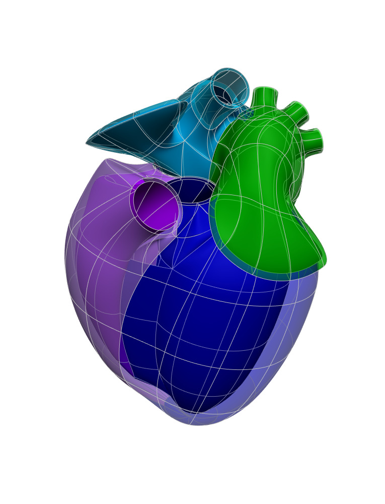

In this workspace we have the `Scaffold Maker <https://github.com/ABI-Software/scaffoldmaker>`_ workflow and
configuration files needed to produce the generic mouse heart scaffold for the `SPARC <https://commonfund.nih.gov/sparc>`_ project.

The heart scaffold consists of separate manifolds to represent different anatomical regions enclosing both the
endocardial and epicardial tissue volumes such as left and right atria, left and right ventricles, pulmonary veins etc.
The mouse heart scaffold was calibrated using data from the literature to represent the anatomy as accurate as possible.

Please see the `SPARC Portal <https://sparc.science>`_ for more details about the SPARC project.