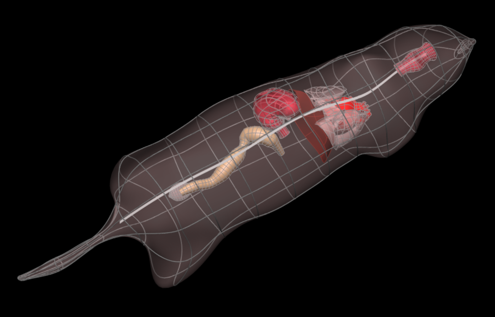

In this workspace, we have the workflow and configuration files needed to produce the mouse whole-body scaffold with embedded organs for the `SPARC <https://commonfund.nih.gov/sparc>`_ project. 

A generic solid cylinder mesh template has been created and forms the core of the whole-body scaffold. Preliminary fitting to mouse geometry has been performed. While the body coordinates field is laid out in the regular coordinates, the geometric coordinates field is fitted to the body of the animal of interest (mouse here) including consistent positioning of interior layers such as between the core cavities and outside layers, at the diaphragm and at each organ fiducial point obtained from the image data. Then the organ fiducial markers were embedded in the body scaffold. The embedded organs include lungs, heart, stomach, bladder and colon. 

The central path used to generate the current mouse whole-body scaffold and data for fitting were obtained from  Mouse Imaging Centre at the University of Toronto (http://www.mouseimaging.ca/). Data is obtained for the core boundary including a realistic path of the spinal cord. The organ fiducial points were obtained from segmenting MRI data.

Please see the `SPARC Portal <https://sparc.science>`_ for more details about the SPARC project.