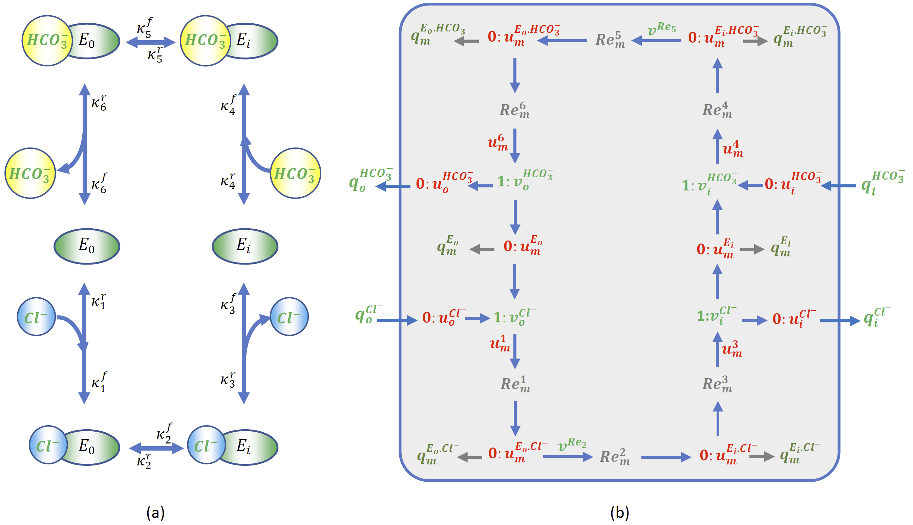

About this model
====================

:Original publication: `Weinstein, A. M. (2000)`_:
  "A computational model of induced pluripotent stem-cell derived cardiomyocytes \
  incorporating experimental variability from multiple data sources" J  Physiol. 2019 Sep 1; 597(17): 4533-4564.

:DOI: https://doi.org/10.1152/ajprenal.2000.279.1.F24

.. _`Weinstein, A. M. (2000)`: https://journals.physiology.org/doi/full/10.1152/ajprenal.2000.279.1.F24/

*************
Figure 03
*************
Chloride and Biocarbonate Flux through AE1 exchanger
********************************************************
The solute-carrier (SLC) group of membrane transport proteins\
carry nutrients and metabolites across cell membranes. They are\
associated with 400 genes that code for 65 protein families\
AE1 is the member of solute carrier family 4 (`SLC4A1`_). This protein known as\
anion exchanger 1 (AE1) which is a chloride/bicarbonate exchanger\
(:math:`Cl^{-}`/:math:`HCO3^{-}` exchanger)  with a main function of retaining
the pH in the correct value.
Figure 3 shows the bond graph representation of AE1 exchanger\
model and the calculation of :math:`Ca^{-}` and :math:`HCO3^{-}`
fluxes across the membrane. There are 6 states for the transport\
enzyme and 6 reactions for the transitions between these states,\
where there are all coded up in `AE1-BG.cellml`_ file.
Each panel of Figure 3 explains the variation of a single internal (A and B)
or external (C and D) anion concentration.

`AE1-BG.cellml`_, `Weinstein_2000_AE1.cellml`_ and `Weinstein_2000_AE1_Fig3.cellml`_ \
are the the main Cellml files for bond graph model and classic model.
`inverse03.py`_ is a python script that creat all the bond graph kinetic rates.
`Fig3A.py`_, `Fig3B.py`_, `Fig3C.py`_ and `Fig3D.py`_ are the main python scripts which load the SEDML file\
for Bg-mdodel and classic model and then plot the fluxes of :math:`Cl^{-}`and :math:`HCO3^{-}`\
through the membrane for both of the files under the conditions that stated in the original paper.\

In order to reproduce Figure 3, execute the following script from the command line:
cd [PathToThisFile]
[PathToOpenCOR]/pythonshell Figure3A-new.py

(a) Schematic diagram of AE1 model. (b) Bond graph representation of AE1 model.

.. _SLC4A1: https://www.genecards.org/cgi-bin/carddisp.pl?gene=SLC4A1
.. _AE1-BG.cellml: https://models.physiomeproject.org/workspace/6b9/file/a3e7d3ee1d1de068eec9b205693d63ad5c4f15bf/AE1-BG.cellml/
.. _Weinstein_2000_AE1.cellml: https://models.physiomeproject.org/workspace/6b9/file/a3e7d3ee1d1de068eec9b205693d63ad5c4f15bf/Weinstein_2000_AE1.cellml/
.. _Weinstein_2000_AE1_Fig3.cellml: https://models.physiomeproject.org/workspace/6b9/file/a3e7d3ee1d1de068eec9b205693d63ad5c4f15bf/Weinstein_2000_AE1_Fig3.cellml
.. _inverse03.py: https://models.physiomeproject.org/workspace/6b9/file/a3e7d3ee1d1de068eec9b205693d63ad5c4f15bf/inverse03.py
.. _Fig3A.py: https://models.physiomeproject.org/workspace/6b9/file/a3e7d3ee1d1de068eec9b205693d63ad5c4f15bf/Fig3A.py/
.. _Fig3B.py: https://models.physiomeproject.org/workspace/6b9/file/a3e7d3ee1d1de068eec9b205693d63ad5c4f15bf/Fig3B.py/
.. _Fig3C.py: https://models.physiomeproject.org/workspace/6b9/file/a3e7d3ee1d1de068eec9b205693d63ad5c4f15bf/Fig3C.py/
.. _Fig3D.py: https://models.physiomeproject.org/workspace/6b9/file/a3e7d3ee1d1de068eec9b205693d63ad5c4f15bf/Fig3D.py/

