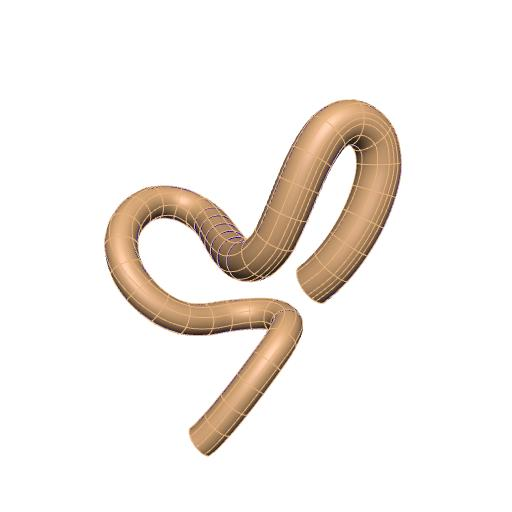

In this workspace we have the mapping tool provenance data file needed to produce the generic mouse colon scaffold for the `SPARC <https://commonfund.nih.gov/sparc>`_ project. The mapping tool will be accessible from the release download page on the `SPARC Portal <https://sparc.science>`_. 

The colon scaffold is designed topologically as a tube defined by a central line which follows the path of a colon traced from an image, which could be obtained from photography, CT or MRI. The scaffold is capable of representing the tubular cross-sectional profile observed in mouse due to absence of tenia coli. The ability to control dimensions such as colon diameter, wall thickness, and tenia coli properties, as well as variations of these properties throughout the entire length of the colon allows the scaffold to be configurable for different center paths and sizes to support different species and individuals. 

The central path used to generate the current mouse colon scaffold is obtained from tracing a central path from a dissection image obtained from literature. Lengths and diameter data are provided by Lixin Wang (UCLA) and Yvette Tache (UCLA) and Marthe Howard (University of Toledo). 

In this release, four wall layers (mucosa, submucosa, circular muscle, and longitudinal muscle) are added to the mouse colon scaffold. The outer surface of the scaffold is annotated as the serosa. The mouse colon scaffold now also has a material coordinate field called colon coordinates. This coordinate field will be used for the data embedding step in the scaffold mapping process. 

Please see the `SPARC Portal <https://sparc.science>`_ for more details about the SPARC project.