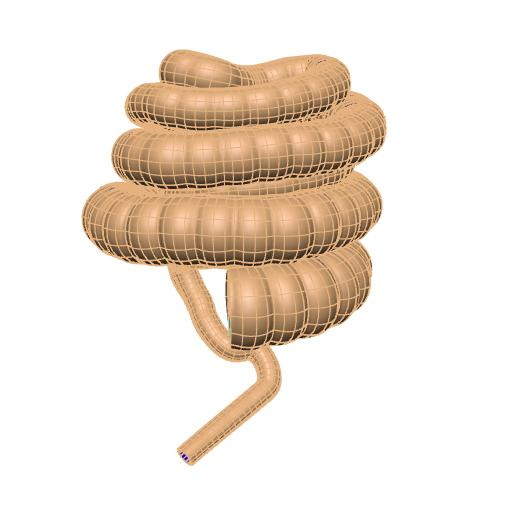

In this workspace we have the mapping tool provenance data file needed to produce the generic pig colon scaffold for the `SPARC <https://commonfund.nih.gov/sparc>`_ project. The mapping tool will be accessible from the release download page on the `SPARC Portal <https://sparc.science>`_. 

The colon scaffold is designed topologically as a tube defined by a central line which follows the path of a colon traced from an image, which could be obtained from photography, CT or MRI. The scaffold captures the haustral sacs appearance due to presence of two tenia coli.  The colon scaffold's haustra are currently very regular, and are representative rather than matching any individual. The ability to control dimensions such as colon diameter, wall thickness, and tenia coli properties, as well as variations of these properties throughout the entire length of the colon allows the scaffold to be configurable for different center paths and sizes to support different species and individuals. 

The pig colon scaffold is generated from images and measurements provided by Million Mulugeta, Muriel Larauche and Yvette Tache (UCLA).

In this release, four wall layers (mucosa, submucosa, circular muscle, and longitudinal muscle) are added to the pig colon scaffold. The outer surface of the scaffold is annotated as the serosa. The pig colon scaffold now also has a material coordinate field called colon coordinates. This coordinate field will be used for the data embedding step in the scaffold mapping process. 

Please see the `SPARC Portal <https://sparc.science>`_ for more details about the SPARC project.