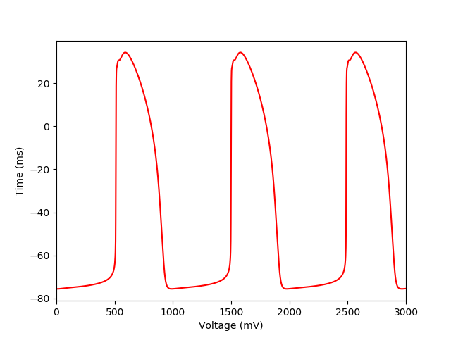

About this model
====================

:Original publication: `Kernik et al. (2019)`_:
  "A computational model of induced pluripotent stem-cell derived cardiomyocytes
  incorporating experimental variability from multiple data sources" J  Physiol. 2019 Sep 1; 597(17): 4533-4564.

:DOI: https://dx.doi.org/10.1113%2FJP277724

.. _`Kernik et al. (2019)`: https://www.ncbi.nlm.nih.gov/pmc/articles/PMC6767694/

************
Figure 11
************
Action potential in the baseline model
****************************************************************************

The developed baseline model including all the channels and current was optimized to reproduce
the spontaneous beating of actional potential as a e key feature of the immature iPSC-CM
phenotype which shows in figure 11.

`Channels.cellml`_ is the main CellML file which shows the I-V curves for different channels fitted to
different experimental data from multiple laboratories.
Its associated SED-ML file contains all the simulation settings.
All the CellML files and SED-ML files need to be download in a same folder
as well as python script (`fig11-new.py`_) . In the `fig11-new.py`_ python script,
required SED-ML file is loaded into the script and by running the code all the required currents
are calculated, and the following figure is reproduced. `fig11-new.py`_  is used to
generate the simulation and reproduces the graph shown in Figure 11 in the original study.
In order to reproduce Figure 11, once all the files are downloaded to the same folder,
execute the following script from the command line (command prompt):

cd [PathToThisFile]

[PathToOpenCOR]/pythonshell fig11-new.py

.. _`Channels.cellml`: https://models.physiomeproject.org/workspace/702/rawfile/2a5d36a02c5e82d6a97c237aa20a7f15d2624862/Components/Channels.cellml
.. _`fig11-new.py`: https://models.physiomeproject.org/workspace/702/rawfile/2a5d36a02c5e82d6a97c237aa20a7f15d2624862/Experiments/fig11-new.py

