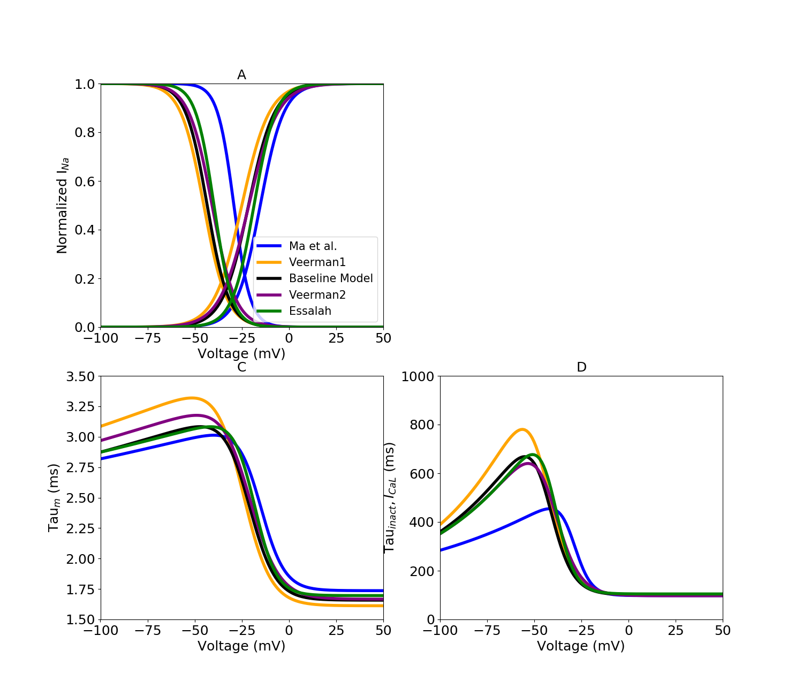

About this model
====================

:Original publication: `Kernik et al. (2019)`_:
  "A computational model of induced pluripotent stem-cell derived cardiomyocytes \
  incorporating experimental variability from multiple data sources" J  Physiol. 2019 Sep 1; 597(17): 4533-4564.

:DOI: https://dx.doi.org/10.1113%2FJP277724

.. _`Kernik et al. (2019)`: https://www.ncbi.nlm.nih.gov/pmc/articles/PMC6767694/

**********
Figure 04
**********
Calcium current model optimization
*************************************

Steady-state inactivation and activation iPSC-CM experimental data, as well as optimized dataset-specific models for
different dataset (Fig. 4 A). Time constants were extracted from current recordings by `Ma et al. (2011)`_
(same as sodium current). The activation and inactivation time constant data used for model optimization, and the resulting
models, are shown in Fig. 4 C and D.

`act_inact.cellml`_  is the main CellML files which show the probability of
calcium channel being open or
close. Its associated Sedml file contains all the simulation settings.
All the CellML files and Sedml files need to be download in a same folder (act_inact, gating, parameter, unit)
as well as python script (`fig4-new.py`_). In the python script, required Sedml file is loaded
into the script and by running the code following figure is reproduced. fig4-new.py is used to
generate the simulation and reproduces the graph shown in Figure 4 in the original study.
In order to reproduce Figure 4, once all the files are downloaded to the same folder,
execute the following script from the command line (command prompt):

cd [PathToThisFile]

[PathToOpenCOR]/pythonshell fig4-new.py

A, L-type calcium current (ICaL) steady-state inactivation and activation \
curves with dataset-specific model optimized to experimental data. The L-type calcium \
model used in the baseline cellular model is shown \
in black. Coloured symbols represent experimental iPSC-CM data from `Ma et al. (2011)`_ \,`Veerman et al. (2016)`_ \
and `Es-Salah-Lamoureux et al. (2016)`_. \
C, time constants of ICaL activation gate. D, time \
constants of ICaL inactivation gate.

.. _`Herron et al. 2016`: https://pubmed.ncbi.nlm.nih.gov/27069088/
.. _`Ma et al. (2011)`: https://pubmed.ncbi.nlm.nih.gov/21890694/
.. _`Li et al. 2017`: https://pubmed.ncbi.nlm.nih.gov/28615142/
.. _`Veerman et al. (2016)`: https://www.nature.com/articles/srep30967/
.. _Es-Salah-Lamoureux et al. (2016): https://pubmed.ncbi.nlm.nih.gov/27590098/
.. _`act_inact.cellml`: https://models.physiomeproject.org/workspace/702/rawfile/2a5d36a02c5e82d6a97c237aa20a7f15d2624862/Components/act_inact.cellml
.. _`fig4-new.py`: https://models.physiomeproject.org/workspace/702/rawfile/2a5d36a02c5e82d6a97c237aa20a7f15d2624862/Experiments/fig4-new.py

