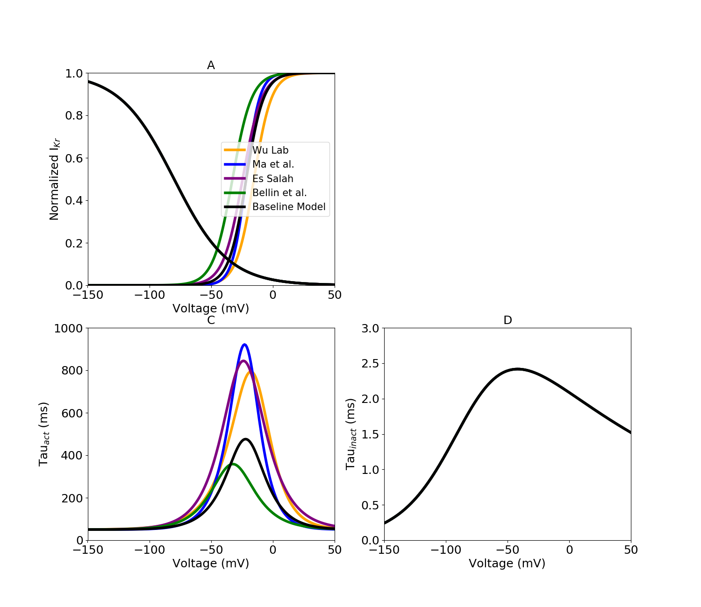

About this model
====================

:Original publication: `Kernik et al. (2019)`_:
  "A computational model of induced pluripotent stem-cell derived cardiomyocytes
  incorporating experimental variability from multiple data sources" J  Physiol. 2019 Sep 1; 597(17): 4533-4564.

:DOI: https://dx.doi.org/10.1113%2FJP277724

.. _`Kernik et al. (2019)`: https://www.ncbi.nlm.nih.gov/pmc/articles/PMC6767694/

************
Figure 05
************
Rapid delayed rectifier potassium current (:math:`I_Kr`) model optimization
****************************************************************************

The voltage dependent activation and inactivation gating variables were modeled here.
The single exponential voltage‐dependent rate constant model
was optimized to fit the voltage dependence of :math:`I_Kr` inactivation in the `ten
Tusscher 2004 model`_. The result of inactivation gating is shown in Fig. 5 A and D.
Activation gating model were fit to four different data for multiple labs; `Ma et al. (2011)`_,
`Garg et al. (2018)`_, `Bellin et al. (2013)`_ and `Es-Salah-Lamoureux et al. (2016)`_.
Parameters in `Ma et al. (2011)`_, `Garg et al. (2018)`_ and `Es-Salah-Lamoureux et al. (2016)`_.
model, were optimized using the time constant activation of `Ma et al. (2011)`_. Time
constant activation in `Bellin et al. (2013)`_ were used in the model. (Fig. 5 C)

`act_inact.cellml`_ is the main CellML file which show the probability of
potassium channel being open or\
close. Its associated SED-ML file contains all the simulation settings.
All the CellML files and SED-ML files need to be download in a same folder (act_inact, gating, parameter, unit)
as well as python script (`fig5-new.py`_). In the python script, required SED-ML file is loaded
into the script and by running the code following figure is reproduced. fig5-new.py is used to
generate the simulation and reproduces the graph shown in Figure 5 in the original study.
In order to reproduce Figure 5, once all the files are downloaded to the same folder,
execute the following script from the command line (command prompt):

cd [PathToThisFile]

[PathToOpenCOR]/pythonshell fig5-new.py

A, optimized activation with dataset-specific model fits. Different colour represent experimental
iPSC-CM data from multiple laboratories. C, Time constant of :math:`I_Kr` activation gate. D,
Time constant of :math:`I_Kr` inactivation gate.

.. _`ten Tusscher 2004 model`: https://journals.physiology.org/doi/full/10.1152/ajpheart.00794.2003/
.. _`Ma et al. (2011)`: https://pubmed.ncbi.nlm.nih.gov/21890694/
.. _`Garg et al. (2018)`: https://www.jacc.org/doi/abs/10.1016/j.jacc.2018.04.041
.. _`Bellin et al. (2013)`: https://www.nature.com/articles/srep30967/https://www.embopress.org/doi/full/10.1038/emboj.2013.240
.. _Es-Salah-Lamoureux et al. (2016): https://pubmed.ncbi.nlm.nih.gov/27590098/
.. _`act_inact.cellml`: https://models.physiomeproject.org/workspace/702/rawfile/2a5d36a02c5e82d6a97c237aa20a7f15d2624862/Components/act_inact.cellml
.. _`fig5-new.py`: https://models.physiomeproject.org/workspace/702/rawfile/2a5d36a02c5e82d6a97c237aa20a7f15d2624862/Experiments/fig5-new.py

