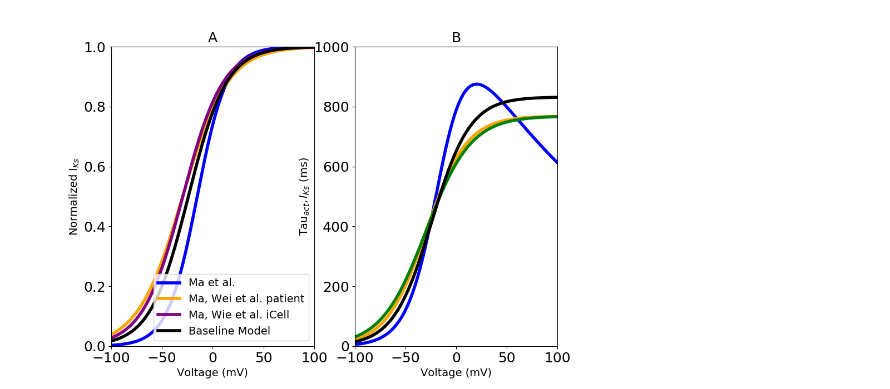

About this model
====================

:Original publication: `Kernik et al. (2019)`_:
  "A computational model of induced pluripotent stem-cell derived cardiomyocytes
  incorporating experimental variability from multiple data sources" J  Physiol. 2019 Sep 1; 597(17): 4533-4564.

:DOI: https://dx.doi.org/10.1113%2FJP277724

.. _`Kernik et al. (2019)`: https://www.ncbi.nlm.nih.gov/pmc/articles/PMC6767694/

************
Figure 07
************
Slow delayed rectifier potassium current (:math:`I_Ks`) model optimization
****************************************************************************

The voltage dependent activation gating variables were modeled here.
experimental iPSC‐CM data collected from `Ma et al. (2011)`_ and two other independent datasets
from `Ma et al. (2015)`_ in order to optimize data specific model. Parameters in all models were
parameterized using the activation time constants from `Ma et al. (2011)`_ (Fig. 7. B).

`act_inact.cellml`_ is the main CellML file which shows the probability of
transient outward potassium channel being open or\
close. Its associated SED-ML file contains all the simulation settings.
All the CellML files and SED-ML files need to be download in a same folder (act_inact, gating, parameter, unit)
as well as python script (`fig7-new.py`_). In the python script, required SED-ML file is loaded
into the script and by running the code following figure is reproduced. `fig7-new.py`_ is used to
generate the simulation and reproduces the graph shown in Figure 7 in the original study.
In order to reproduce Figure 7, once all the files are downloaded to the same folder,
execute the following script from the command line (command prompt):

cd [PathToThisFile]

[PathToOpenCOR]/pythonshell fig7-new.py

A, optimized steady-state activation with dataset-specific model fits. Different colour represent experimental
iPSC-CM data from multiple laboratories. B, Time constant of :math:`I_Ks` activation gate.

.. _`Ma et al. (2011)`: https://pubmed.ncbi.nlm.nih.gov/21890694/
.. _`Ma et al. (2015)`: https://pubmed.ncbi.nlm.nih.gov/25889101/

.. _`act_inact.cellml`: https://models.physiomeproject.org/workspace/702/rawfile/2a5d36a02c5e82d6a97c237aa20a7f15d2624862/Components/act_inact.cellml
.. _`fig7-new.py`: https://models.physiomeproject.org/workspace/702/rawfile/2a5d36a02c5e82d6a97c237aa20a7f15d2624862/Experiments/fig7-new.py

