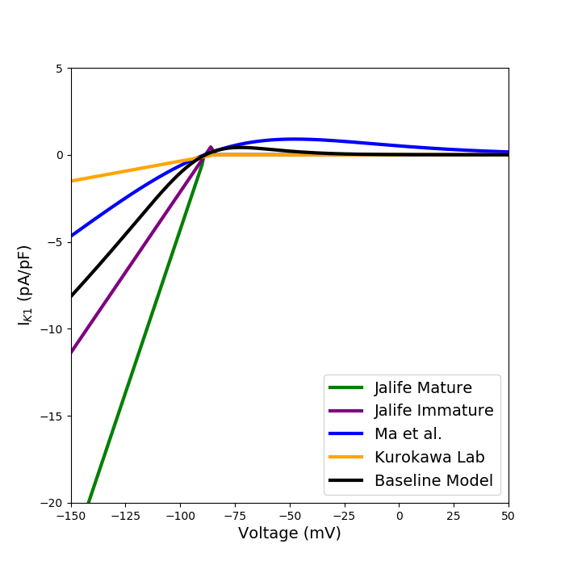

About this model
====================

:Original publication: `Kernik et al. (2019)`_:
  "A computational model of induced pluripotent stem-cell derived cardiomyocytes
  incorporating experimental variability from multiple data sources" J  Physiol. 2019 Sep 1; 597(17): 4533-4564.

:DOI: https://dx.doi.org/10.1113%2FJP277724

.. _`Kernik et al. (2019)`: https://www.ncbi.nlm.nih.gov/pmc/articles/PMC6767694/

************
Figure 09
************
Inward rectifier potassium current (:math:`I_{K1}`) model optimization
****************************************************************************

The slow delayed rectifier potassium current was modeled here.
experimental iPSC-CM data collected from `Ma et al. (2011)`_ , Kurokawa Lab (`Li et al. (2017)`_),
and the Jalife Lab (`Herron et al. (2016)`_) in order to optimize data specific model.

`Channels.cellml`_ is the main CellML file which shows the I-V curves for different channels fitted to
different experimental data from multiple laboratories.
Its associated SED-ML file contains all the simulation settings.
All the CellML files and SED-ML files need to be download in a same folder,
as well as python script (`fig9-new.py`_) which can reproduce the
I-V curve for :math:`I_{K1}`. In the python script, required SED-ML file is loaded
into the script and by running the code following figure is reproduced. `fig9-new.py`_ is used to
generate the simulation and reproduces the graph shown in Figure 9 in the original study.
In order to reproduce Figure 9, once all the files are downloaded to the same folder,
execute the following script from the command line (command prompt):

cd [PathToThisFile]

[PathToOpenCOR]/pythonshell fig9-new.py

    iPSC-CM data from multiple laboratories

.. _`Ma et al. (2011)`: https://pubmed.ncbi.nlm.nih.gov/21890694/
.. _`Li et al. (2017)`: https://pubmed.ncbi.nlm.nih.gov/28615142/
.. _`Herron et al. (2016)`: https://www.ahajournals.org/doi/full/10.1161/CIRCEP.113.003638

.. _`Channels.cellml`: https://models.physiomeproject.org/workspace/702/rawfile/2a5d36a02c5e82d6a97c237aa20a7f15d2624862/Components/Channels.cellml
.. _`fig9-new.py`: https://models.physiomeproject.org/workspace/702/rawfile/2a5d36a02c5e82d6a97c237aa20a7f15d2624862/Experiments/fig9-new.py

