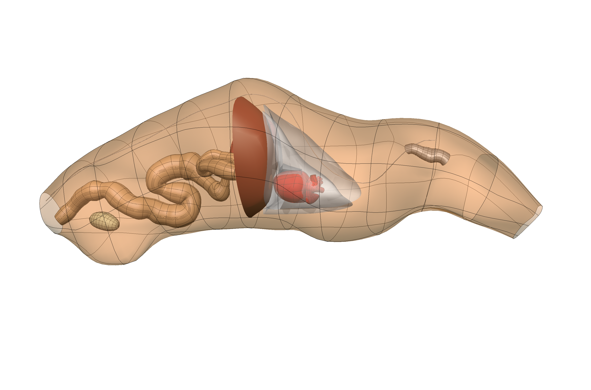

In this workspace, we have the automatic workflow and configuration files for inserting organs needed to produce the rat whole-body scaffold with embedded organs for the `SPARC <https://commonfund.nih.gov/sparc>`_ project. 

A MAP Client workflow is created with a new step (organinserter) in python language to automate insertion of 3D organs into the whole-body scaffolds. The whole-body scaffold along with the organs are passed to the workflow and then it finds the common fiducial markers in the whole-body and each organ. These fiducials then are used to register the organ into the body. The embedded organs include lungs, heart, stomach, bladder and colon.

Please see the `SPARC Portal <https://sparc.science>`_ for more details about the SPARC project.