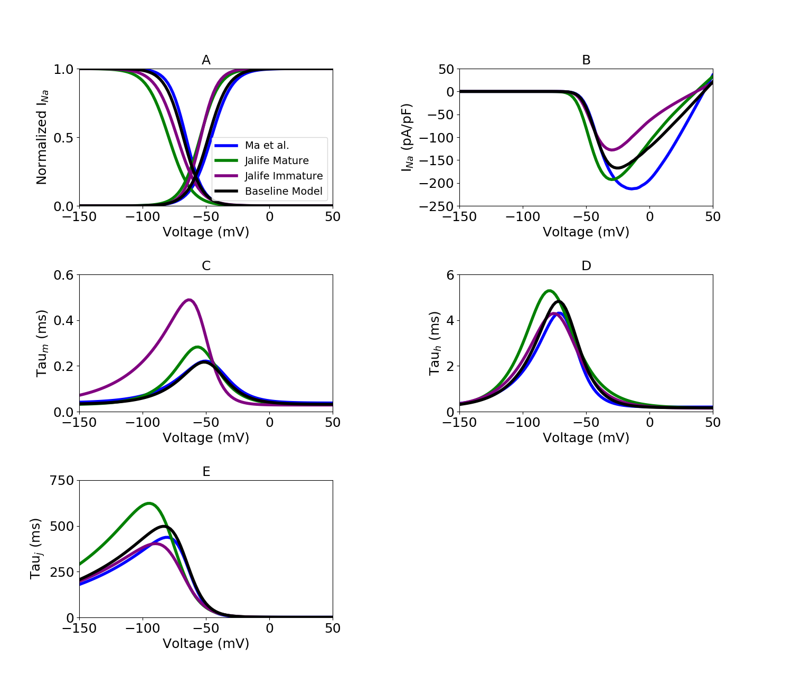

About this model
====================

:Original publication: `Kernik et al. (2019)`_:
  "A computational model of induced pluripotent stem-cell derived cardiomyocytes \
  incorporating experimental variability from multiple data sources" J  Physiol. 2019 Sep 1; 597(17): 4533-4564.

:DOI: https://dx.doi.org/10.1113%2FJP277724

.. _`Kernik et al. (2019)`: https://www.ncbi.nlm.nih.gov/pmc/articles/PMC6767694/

**********
Figure 02
**********
Sodium current (:math:`I_Na`) model optimization
*************************************************

For sodium currents, model parameters were optimized to multiple experimental datasets,
resulting in dataset-specific parameterization instances of the model.
For each dataset-specific model, external ion concentrations
and voltage protocols were set to reflect the corresponding experimental conditions.
All of the experimental data used to optimize the models were collected in iCell iPSC-CMs.
This process was used to generate dataset-specific models.
Three separate experimental iPSC-CM datasets are used for sodium current:
(A) Ma et al. (B) Jalife Immature, (C) Jalife Mature and (D) Baseline model

`Current_Ina.cellml`_  is the main CellML files which has all the formulation for sodium current,
Its associated Sedml file contains all the simulation settings.

All the CellML files and SED-ML files related to this channel need to be downloaded in a same folder (Current_Ina, gating_Ina, parameter_Ina, parameter, unit)
as well as python script (`fig2.py`_). In the python script, required SED-ML file (Current_Ina.sedml) is loaded
into the script and by running the code following figure is reproduced. fig2.py is used to
generate the simulation and reproduces the graph shown in Figure 3 in the original study.
In order to reproduce Figure 3, once all the files are downloaded to the same folder,
execute the following script from the command line (command prompt):

cd [PathToThisFile]

[PathToOpenCOR]/pythonshell fig2.py

   A, steady-state inactivation and activation curves. The sodium current model used in \
   the baseline whole-cell model is shown in black. Colours represent distinct experimental \
   iPSC-CM data from `Ma et al. (2011)`_ and from immature and mature cell preparations \
   from the Jalife lab (`Herron et al. 2016`_). B, I–V curves for INa. Dataset-specific models \
   were simulated using the experimental conditions of the corresponding experimental data. \
   C, INa activation (m-gate) time constants. D, INa fast-inactivation (h-gate) \
   time constants. E, INa slow-inactivation (j-gate) time constants. j-gate time constant \
   parameters for all INa models were optimized to experimental iPSC-CM data from \
   the Kurokawa lab (`Li et al. 2017`_).

.. _`Herron et al. 2016`: https://pubmed.ncbi.nlm.nih.gov/27069088/
.. _`Ma et al. (2011)`: https://pubmed.ncbi.nlm.nih.gov/21890694/
.. _`Li et al. 2017`: https://pubmed.ncbi.nlm.nih.gov/28615142/
.. _`fig2.py`: https://models.physiomeproject.org/workspace/702/rawfile/a619946dc2f89d6d787cebfbd9b1f2a54f5aa227/fig2.py
.. _`Current_Ina.cellml`: https://models.physiomeproject.org/workspace/702/rawfile/a619946dc2f89d6d787cebfbd9b1f2a54f5aa227/Current_Ina.cellml

