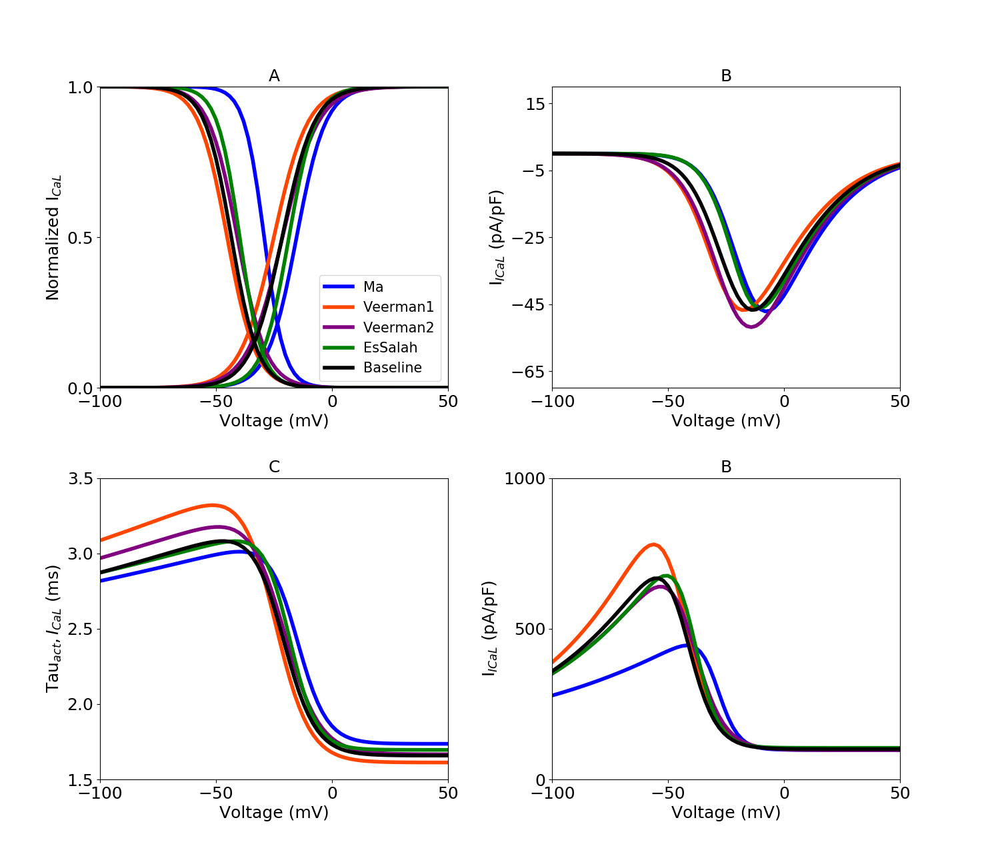

About this model
====================

:Original publication: `Kernik et al. (2019)`_:
  "A computational model of induced pluripotent stem-cell derived cardiomyocytes \
  incorporating experimental variability from multiple data sources" J  Physiol. 2019 Sep 1; 597(17): 4533-4564.

:DOI: https://dx.doi.org/10.1113%2FJP277724

.. _`Kernik et al. (2019)`: https://www.ncbi.nlm.nih.gov/pmc/articles/PMC6767694/

**********
Figure 03
**********
Calcium current model optimization
*************************************

Steady-state inactivation and activation iPSC-CM experimental data, with optimized dataset-specific models for
different dataset (Fig. 3 A).  I-V curves for ICaL. Calcium-dependent gating model formulation retained from
ten `Tusscher (2004)`_ adult cardiomyocyte model with parameter optimization to fit whole cell iPSC-CM outputs (Fig. 3 B)
Time constants were extracted from current recordings by `Ma et al. (2011)`_
(same as sodium current). The activation and inactivation time constant data used for model optimization, and the resulting
models, are shown in Fig. 3 C and D.

`Current_Ica.cellml`_  is the main CellML files which has all the formulation for calcium current,
Its associated Sedml file contains all the simulation settings.

All the CellML files and SED-ML files related to this channel need to be downloaded in a same folder (Current_Ica, gating_Ica, parameter_Ica, parameter, unit)
as well as python script (`fig3.py`_). In the python script, required Sedml file (Current_Ica.sedml) is loaded
into the script and by running the code following figure is reproduced. fig3.py is used to
generate the simulation and reproduces the graph shown in Figure 4 in the original study.
In order to reproduce Figure 4, once all the files are downloaded to the same folder,
execute the following script from the command line (command prompt):

cd [PathToThisFile]

[PathToOpenCOR]/pythonshell fig3.py

A, L-type calcium current (ICaL) steady-state inactivation and activation \
curves with dataset-specific model optimized to experimental data. The L-type calcium \
model used in the baseline cellular model is shown \
in black. Coloured symbols represent experimental iPSC-CM data from `Ma et al. (2011)`_ \,`Veerman et al. (2016)`_ \
and `Es-Salah-Lamoureux et al. (2016)`_. \
B, I-V curves for ICaL,
C, time constants of ICaL activation gate. D, time \
constants of ICaL inactivation gate.

.. _`Tusscher (2004)`: https://pubmed.ncbi.nlm.nih.gov/14656705/
.. _`Ma et al. (2011)`: https://pubmed.ncbi.nlm.nih.gov/21890694/
.. _`Li et al. 2017`: https://pubmed.ncbi.nlm.nih.gov/28615142/
.. _`Veerman et al. (2016)`: https://www.nature.com/articles/srep30967/
.. _Es-Salah-Lamoureux et al. (2016): https://pubmed.ncbi.nlm.nih.gov/27590098/
.. _`Current_Ica.cellml`: https://models.physiomeproject.org/workspace/702/rawfile/a619946dc2f89d6d787cebfbd9b1f2a54f5aa227/Current_Ica.cellml
.. _`fig3.py`: https://models.physiomeproject.org/workspace/702/rawfile/a619946dc2f89d6d787cebfbd9b1f2a54f5aa227/fig3.py

