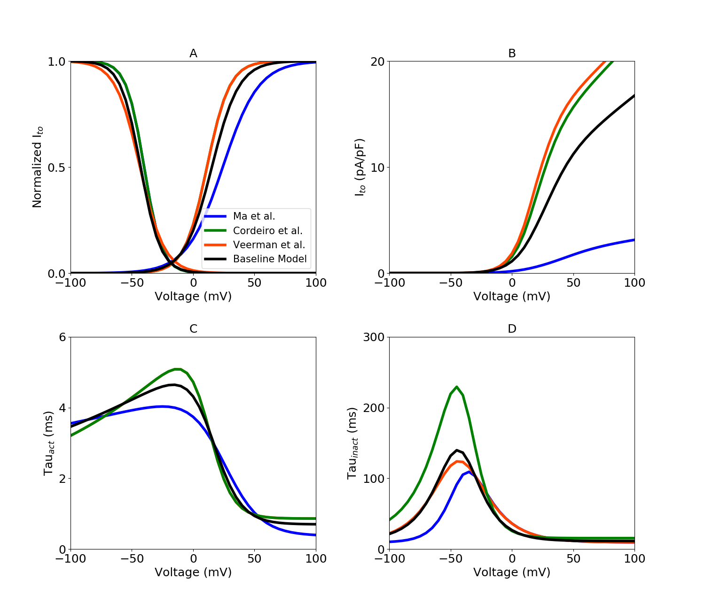

About this model
====================

:Original publication: `Kernik et al. (2019)`_:
  "A computational model of induced pluripotent stem-cell derived cardiomyocytes
  incorporating experimental variability from multiple data sources" J  Physiol. 2019 Sep 1; 597(17): 4533-4564.

:DOI: https://dx.doi.org/10.1113%2FJP277724

.. _`Kernik et al. (2019)`: https://www.ncbi.nlm.nih.gov/pmc/articles/PMC6767694/

************
Figure 05
************
Transient outward potassium current (:math:`I_to`) model optimization
****************************************************************************
The voltage dependent activation and inactivation gating variables were modeled here.
experimental iPSC‐CM data collected from `Ma et al. (2011)`_, `Cordeiro et al. (2013)`_
and `Veerman et al. (2016)`_ in order to optimize data specific model.
Steady-state inactivation and activation iPSC-CM experimental data, with optimized dataset-specific models for
different dataset (Fig. 5 A)
Since non of the datasets had both steady-state activation and inactivation data therefore,
Inactivation time constant parameters of `Veerman et al. (2016)`_ model were optimized with time
constant activation from `Ma et al. (2011)`_. `Cordeiro et al. (2013)`_ model parameters were optimized
with steady-state activation parameters from `Ma et al. (2011)`_ and steady-state inactivation
data from `Cordeiro et al. (2013)`_ were used to optimize the model of `Ma et al. (2011)`_. All the
results are presented in Fig. 5. D.
Time constant activation parameters were optimized to `ten Tusscher (2004)`_ model which is shown
in Fig. 5 C. I-V curves for :math:`I_to` (Fig. 5. B).

`Current_Ito.cellml`_  is the main CellML files which has all the formulation for transient outward potassium current,
Its associated Sedml file contains all the simulation settings.

All the CellML files and SED-ML files related to this channel need to be downloaded in a same folder (Current_Ito, gating_Ito, parameter_Ito, parameter, unit)
as well as python script (`fig5.py`_). In the python script, required Sedml file (Current_Ito.sedml) is loaded
into the script and by running the code following figure is reproduced. `fig5.py`_ is used to
generate the simulation and reproduces the graph shown in Figure 6 in the original study.
In order to reproduce Figure 6, once all the files are downloaded to the same folder,
execute the following script from the command line (command prompt):

cd [PathToThisFile]

[PathToOpenCOR]/pythonshell fig5.py

A, optimized activation with dataset-specific model fits. Different colour represent experimental
iPSC-CM data from multiple laboratories. B. I-V curves, C, Time constant of :math:`I_to` activation gate. D,
Time constant of :math:`I_to` inactivation gate.

.. _`ten Tusscher (2004)`: https://journals.physiology.org/doi/full/10.1152/ajpheart.00794.2003/
.. _`Ma et al. (2011)`: https://pubmed.ncbi.nlm.nih.gov/21890694/
.. _`Veerman et al. (2016)`: https://www.nature.com/articles/srep30967/
.. _`Cordeiro et al. (2013)`: https://pubmed.ncbi.nlm.nih.gov/23542310/

.. _`Current_Ito.cellml`: https://models.physiomeproject.org/workspace/702/rawfile/a619946dc2f89d6d787cebfbd9b1f2a54f5aa227/Current_Ito.cellml
.. _`fig5.py`: https://models.physiomeproject.org/workspace/702/rawfile/a619946dc2f89d6d787cebfbd9b1f2a54f5aa227/fig5.py

