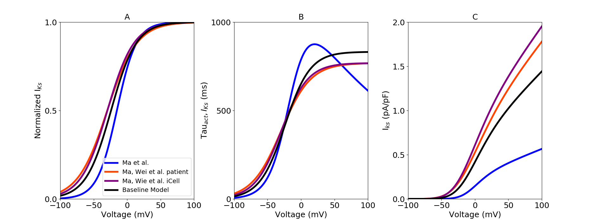

About this model
====================

:Original publication: `Kernik et al. (2019)`_:
  "A computational model of induced pluripotent stem-cell derived cardiomyocytes
  incorporating experimental variability from multiple data sources" J  Physiol. 2019 Sep 1; 597(17): 4533-4564.

:DOI: https://dx.doi.org/10.1113%2FJP277724

.. _`Kernik et al. (2019)`: https://www.ncbi.nlm.nih.gov/pmc/articles/PMC6767694/

************
Figure 06
************
Slow delayed rectifier potassium current (:math:`I_Ks`) model optimization
****************************************************************************

The voltage dependent activation gating variables were modeled here.
experimental iPSC‐CM data collected from `Ma et al. (2011)`_ and two other independent datasets
from `Ma et al. (2015)`_ in order to optimize data specific model.
Steady-state inactivation and activation iPSC-CM experimental data, with optimized dataset-specific models for
different dataset (Fig. 6 A)
Parameters in all models were parameterized using the activation time constants from `Ma et al. (2011)`_ (Fig. 6. B). and I-V curves for
:math:`I_Ks` (Fig. 6. C).

`Current_Iks.cellml`_  is the main CellML files which has all the formulation for slow delayed rectifier potassium current,
Its associated Sedml file contains all the simulation settings.

All the CellML files and SED-ML files related to this channel need to be downloaded in a same folder (Current_Iks, gating_Iks, parameter_Iks, parameter, unit)
as well as python script (`fig6.py`_). In the python script, required Sedml file (Current_Iks.sedml) is loaded
into the script and by running the code following figure is reproduced. `fig6.py`_ is used to
generate the simulation and reproduces the graph shown in Figure 7 in the original study.
In order to reproduce Figure 7, once all the files are downloaded to the same folder,
execute the following script from the command line (command prompt):

cd [PathToThisFile]

[PathToOpenCOR]/pythonshell fig6.py

A, optimized steady-state activation with dataset-specific model fits. Different colour represent experimental
iPSC-CM data from multiple laboratories. B, Time constant of :math:`I_Ks` activation gate. C, I-V curves.

.. _`Ma et al. (2011)`: https://pubmed.ncbi.nlm.nih.gov/21890694/
.. _`Ma et al. (2015)`: https://pubmed.ncbi.nlm.nih.gov/25889101/

.. _`Current_Iks.cellml`: https://models.physiomeproject.org/workspace/702/rawfile/a619946dc2f89d6d787cebfbd9b1f2a54f5aa227/Current_Iks.cellml
.. _`fig6.py`: https://models.physiomeproject.org/workspace/702/rawfile/a619946dc2f89d6d787cebfbd9b1f2a54f5aa227/fig6.py

