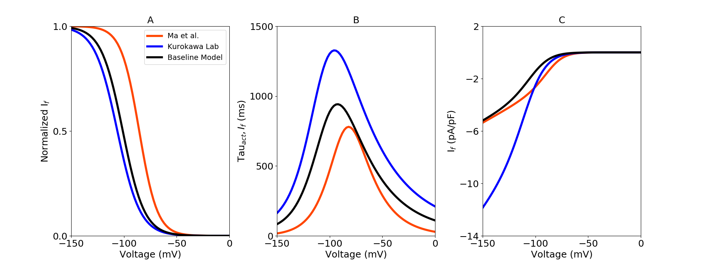

About this model
====================

:Original publication: `Kernik et al. (2019)`_:
  "A computational model of induced pluripotent stem-cell derived cardiomyocytes
  incorporating experimental variability from multiple data sources" J  Physiol. 2019 Sep 1; 597(17): 4533-4564.

:DOI: https://dx.doi.org/10.1113%2FJP277724

.. _`Kernik et al. (2019)`: https://www.ncbi.nlm.nih.gov/pmc/articles/PMC6767694/

************
Figure 07
************
Pacemaker/funny current (:math:`I_f`) model optimization
****************************************************************************

The voltage dependent activation gating variables were modeled here.
experimental iPSC‐CM data collected from `Ma et al. (2011)`_ and Kurokawa Lab `Li et al. (2017)`_
in order to optimize data specific model. Activation gate parameters were
optimized using the steady-state activation and activation time constants from experimental data
(Fig. 7. A and B). I-V curves for :math:`I_f` (Fig. 7. C).

`Current_If.cellml`_  is the main CellML files which has all the formulation for Pacemaker/funny current,
Its associated Sedml file contains all the simulation settings.

All the CellML files and SED-ML files related to this channel need to be downloaded in a same folder (Current_If, gating_If, parameter_If, parameter, unit)
as well as python script (`fig7.py`_). In the python script, required Sedml file (Current_If.sedml) is loaded
into the script and by running the code following figure is reproduced.`fig7.py`_ is used to
generate the simulation and reproduces the graph shown in Figure 8 in the original study.
In order to reproduce Figure 8, once all the files are downloaded to the same folder,
execute the following script from the command line (command prompt):

cd [PathToThisFile]

[PathToOpenCOR]/pythonshell fig7.py

A, optimized steady-state activation with dataset-specific model fits. Different colour represent experimental
iPSC-CM data from multiple laboratories. B, Time constant of :math:`I_f` activation gate. C, I-V curves.

.. _`Ma et al. (2011)`: https://pubmed.ncbi.nlm.nih.gov/21890694/
.. _`Li et al. (2017)`: https://pubmed.ncbi.nlm.nih.gov/28615142/
.. _`Current_If.cellml`: https://models.physiomeproject.org/workspace/702/rawfile/a619946dc2f89d6d787cebfbd9b1f2a54f5aa227/Current_If.cellml
.. _`fig7.py`: https://models.physiomeproject.org/workspace/702/rawfile/a619946dc2f89d6d787cebfbd9b1f2a54f5aa227/fig7.py

