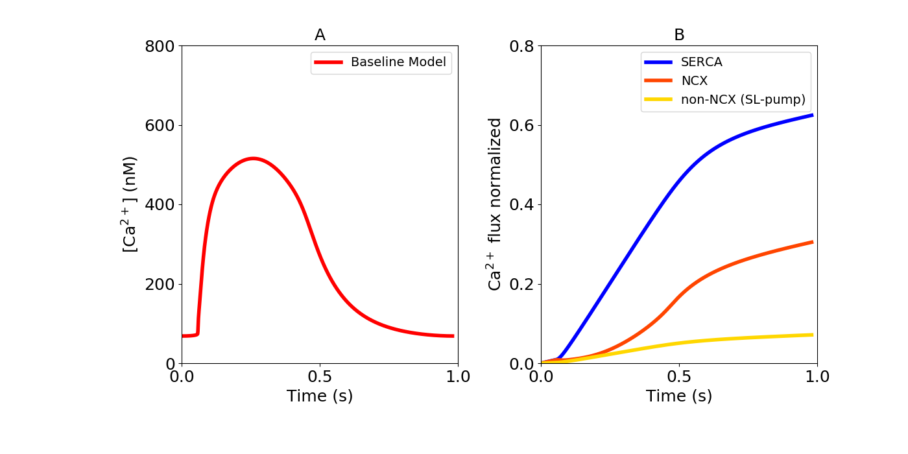

About this model
====================

:Original publication: `Kernik et al. (2019)`_:
  "A computational model of induced pluripotent stem-cell derived cardiomyocytes
  incorporating experimental variability from multiple data sources" J  Physiol. 2019 Sep 1; 597(17): 4533-4564.

:DOI: https://dx.doi.org/10.1113%2FJP277724

.. _`Kernik et al. (2019)`: https://www.ncbi.nlm.nih.gov/pmc/articles/PMC6767694/

************
Figure 09
************
Optimization of calcium handling in the iPSC-CM baseline model
****************************************************************************

In figure 9-A baseline model of calcium transient is shown. Also the contribution of SERCA (:math:`J_{up}`),
sodium-calcium exchanger(:math:`I_{NCX}`) and sarcolema pump(:math:`I_{PMCA}`) fluxes are presented in figure 9-B.
comparison of the mentioned fluxes were provided by `Hwang et al. (2015)`_ from six iPSC-CM datasets within three different
labs. Maximal of :math:`I_{SERCA}`, :math:`I_{NCX}` and :math:`I_{PMCA}` in the baseline model first optimized
to fit the relative contribution of each current during a single CaT and then normalized to total calcium contribution
from all the currents for a single action potential in the baseline model after reaching steady state.

`Channels.cellml`_ is the main CellML file which shows the I-V curves for different channels fitted to
different experimental data from multiple laboratories.
Its associated SED-ML file contains all the simulation settings.
All the CellML files and SED-ML files need to be download in a same folder (gating_Ik1, parameter_Ik1, gating_Ikr,
parameter_Ikr, gating_Iks, parameter_Iks, gating_Ito, parameter_Ito, gating_Ica, parameter_Ica, gating_Icat,
gating_Ina, parameter_Ina, gating_If, parameter_If, parameter, unit)
as well as python scripts (`fig9.py`_ ). In the `fig9.py`_ python script,
required SED-ML file (Channels.sedml) is loaded into the script and by running the code all the required currents
are calculated and the following figure is reproduced. `fig9.py`_  are used to
generate the simulation and reproduces the graph shown in Figure 10 in the original study.
In order to reproduce Figure 10, once all the files are downloaded to the same folder,
execute the following script from the command line (command prompt):

cd [PathToThisFile]

[PathToOpenCOR]/pythonshell fig9.py

    and :math:`I_{PMCA}` to the CaT during a single AP in the baseline mode. (Blue: 62% SERCA, Red: 31% NCX, Yellow:
    7% non-NCX (SL-pump))

.. _`Hwang et al. (2015)`: https://www.sciencedirect.com/science/article/pii/S0022282815001510

.. _`Channels.cellml`: https://models.physiomeproject.org/workspace/702/rawfile/a619946dc2f89d6d787cebfbd9b1f2a54f5aa227/Channels.cellml
.. _`fig9.py`: https://models.physiomeproject.org/workspace/702/rawfile/a619946dc2f89d6d787cebfbd9b1f2a54f5aa227/fig9.py

