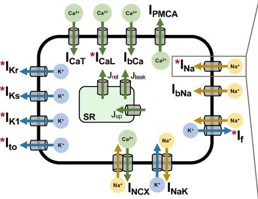

About this model
*****************

:Original publication: `Kernik et al. (2019)`_:
  "A computational model of induced pluripotent stem-cell derived cardiomyocytes \
  incorporating experimental variability from multiple data sources" J  Physiol. 2019 Sep 1; 597(17): 4533-4564.

:DOI: https://dx.doi.org/10.1113%2FJP277724

Model status
**************

The current CellML model implementation runs OpenCOR_.
The simulation setting saved in SED-ML file. \
SED-ML file then loaded into Python script in order for the code to go through \
the loop and capture the results for different initial conditions and inputs.
Each Python script under the Navigation menu reproduces a given
result from Kernik et al (2019). Each of the scripts is documented to describe the CellML model(s) used and the results obtained.

Model overview
*****************
This workspace holds a CellML_ and Python encoding of the `Kernik et al. (2019)`_
model. The original model developed a whole cell model of
induced pluripotent stem cell-derived cardiomyocytes (iPSC-CMs)
composed of simple model components comprising ion channel models with single exponential
voltage-dependent gating variable rate constants. The model were parameterized to fit experimental
iPSC-CM data from multiple laboratories for all major ionic currents. The resulting population
of cellular models predicts robust inter-subject variability in iPSC-CMs.
This approach links molecular mechanisms to known cellular-level iPSC-CM phenotypes,
as shown by comparing immature and mature subpopulations of models to analyse the contributing
factors underlying each phenotype.

   A diagrammatic representation of the Kernik et al. (2019) model. (Image from Fig 1 in the original paper)

.. _CellML: https://www.cellml.org/
.. _OpenCOR: https://opencor.ws/
.. _GitHub: https://github.com/ClancyLabUCD/IPSC-model/

Modular description
********************

CellML can build a model in a modular way which divides the model
into distinct modules, which can be re-used.
The main CellML files:

- Main file that put all the other required files together: `Channels <https://models.physiomeproject.org/workspace/702/rawfile/a619946dc2f89d6d787cebfbd9b1f2a54f5aa227/Channels.cellml>`_

    this file is the main CellML file which is the top model in the hierarchical modular
    presentation and rest of the files need to be imported here in order to run the simulation.

- These files have the formulation for calculating each channel's current (for instance: *Current_Ik1*): `Current_Ik1 <https://models.physiomeproject.org/workspace/702/rawfile/a619946dc2f89d6d787cebfbd9b1f2a54f5aa227/Current_Ik1.cellml>`_

- Probability of channels gates being open or close: (for instance: *gating_Ik1*): `gating_Ik1 <https://models.physiomeproject.org/workspace/702/rawfile/a619946dc2f89d6d787cebfbd9b1f2a54f5aa227/gating_Ik1.cellml>`_

    these files has the fomulation for calculating the probability of channels gates being
    open or close and also the activation/inactivation time constants.
    gating files need to be imported into their associated current files in order to run the simulation and calculate the Voltage-dependent activation/inactivation gating variables (:math:`X_act` and :math:`X_inact`).

- General file for required parameters: `parameter <https://models.physiomeproject.org/workspace/702/rawfile/a619946dc2f89d6d787cebfbd9b1f2a54f5aa227/parameter.cellml>`_

    This file is a general file, specific parameters for calculating the probability of each channel's gate being
    open or close are presented in associated python script.

- some of the channels have their own parameters which are collected in specific file (for instance: *parameter_Ik1*): `parameter_Ik1 <https://models.physiomeproject.org/workspace/702/rawfile/a619946dc2f89d6d787cebfbd9b1f2a54f5aa227/parameter_Ik1.cellml>`_

- All the required units for this simulation: `unit <https://models.physiomeproject.org/workspace/702/rawfile/a619946dc2f89d6d787cebfbd9b1f2a54f5aa227/unit.cellml>`_

The model run the simulation for each channel in the primary paper by using the python scripts in order to reproduce the figures.
In each section in the navigation panel, simulation calculates
the probability of that channel being open or close, Voltage-dependent activation and inactivation gating variables, Time constants of activation/inactivation gates.
Each figure includes one python script
which can load the SED-ML file and provide the
simulation results. In each figure, parameters for voltage-dependent activation and inactivation gates
were optimized to iPSC-CM experimental data from various laboratories. baseline model calculate all the
current through different channels and needs its own python script in order to plot the action potential of developed model.
Calcium analysis needs the python script for the baseline model as well as other function saved in different script in order to show
the calcium analysis.

This workspace has nine sets of python scripts and corresponding simulation results, we just provided
the simulation results here in order to check the reproducibility of figures (3-11) in the primary paper:

1. :math:`I_Na` : `Sodium current model optimization <https://models.physiomeproject.org/workspace/702/rawfile/a619946dc2f89d6d787cebfbd9b1f2a54f5aa227/fig2.py>`_

2. :math:`I_CaL` : `Calcium current model optimization <https://models.physiomeproject.org/workspace/702/rawfile/a619946dc2f89d6d787cebfbd9b1f2a54f5aa227/fig3.py>`_

3. :math:`I_Kr` : `Rapid delayed rectifier potassium current model optimization <https://models.physiomeproject.org/workspace/702/rawfile/a619946dc2f89d6d787cebfbd9b1f2a54f5aa227/fig4.py>`_

4. :math:`I_to` : `Transient outward potassium current model optimization <https://models.physiomeproject.org/workspace/702/rawfile/a619946dc2f89d6d787cebfbd9b1f2a54f5aa227/fig5.py>`_

5. :math:`I_Ks` : `Slow delayed rectifier potassium current model optimization <https://models.physiomeproject.org/workspace/702/rawfile/a619946dc2f89d6d787cebfbd9b1f2a54f5aa227/fig6.py>`_

6. :math:`I_f` : `Pacemaker/funny current model optimization <https://models.physiomeproject.org/workspace/702/rawfile/a619946dc2f89d6d787cebfbd9b1f2a54f5aa227/fig7.py>`_

7. :math:`I_{K1}` : `Inward rectifier potassium current model optimization <https://models.physiomeproject.org/workspace/702/rawfile/a619946dc2f89d6d787cebfbd9b1f2a54f5aa227/fig8.py>`_

8. Calcium Analysis :  `Optimization of calcium handling in the iPSC-CM baseline model <https://models.physiomeproject.org/workspace/702/rawfile/a619946dc2f89d6d787cebfbd9b1f2a54f5aa227/fig9.py>`_

9. baseline model AP: `Action potential in the iPSC-CM baseline model <https://models.physiomeproject.org/workspace/702/rawfile/a619946dc2f89d6d787cebfbd9b1f2a54f5aa227/fig10.py>`_

Simulation settings
*********************
Simulation settings (solver, duration of the simulation, etc) are stored in SED-ML files.
The Python scripts contains the required parameters and conditions for each channel
to run simulation and then plot the results with Matplotlib library to reproduce the figures
in the original paper. The name of each scripts presents the Figure number in the primary paper.
For example, fig2.py is used to generate the simulation and reproduces the graph shown in
Figure 3 in the original study.
In order to reproduce this figure, once all the files are downloaded to the same folder,
execute the following script from the command line (command prompt):

cd [PathToThisFile]

[PathToOpenCOR]/pythonshell fig2.py

Model History
*******************
The original model of **induced pluripotent stem-cell derived cardiomyocytes incorporating
experimental variability from multiple data sources** was built in MATLAB which can be
downloaded from GitHub_.

.. _`Kernik et al. (2019)`: https://www.ncbi.nlm.nih.gov/pmc/articles/PMC6767694/

