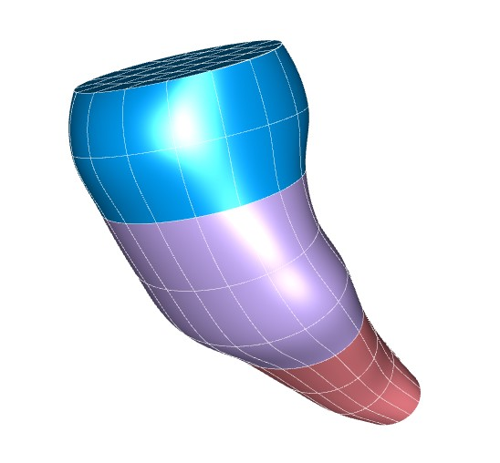

In this workspace we have the `Scaffold Maker <https://github.com/ABI-Software/scaffoldmaker>`_ workflow and configuration files needed to produce the pig brainstem scaffold for the `SPARC <https://commonfund.nih.gov/sparc>`_ project. 

The pig brainstem scaffold is created to map nerve ending pathway and fit the geometry of each specific brainstem. The brainstem scaffold is generated with a configurable central path defined from medulla oblongata to midbrain. The derivatives of the central path control the contour and curvature of the scaffold. The brainstem scaffold is also annotated in each region and specific points allowing a user to comprehend the structure of the brainstem readily. The annotation groups are linked to the world database website (Scicrunch). The pig brainstem scaffold was fitted and smoothed to the segmented datasets from a 12-week-old pig (Beckman Institute for Advanced Science and Technology, Pig Imaging Group, University Of Illiois urbana-champaign).

Please see the `SPARC Portal <https://sparc.science>`_ for more details about the SPARC project.
