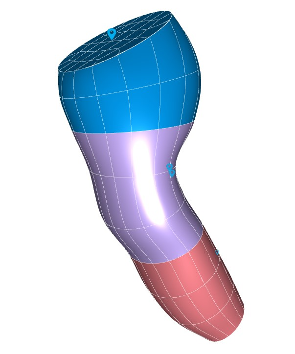

In this workspace we have the `Scaffold Maker <https://github.com/ABI-Software/scaffoldmaker>`_ workflow and configuration files needed to produce the sheep brainstem scaffold for the `SPARC <https://commonfund.nih.gov/sparc>`_ project. 

The sheep brainstem scaffold is created to map nerve ending pathway and fit the geometry of each specific brainstem. The brainstem scaffold is generated with a configurable central path defined from medulla oblongata to midbrain. The derivatives of the central path control the contour and curvature of the scaffold. The brainstem scaffold is also annotated in each region and specific points allowing a user to comprehend the structure of the brainstem readily. The annotation groups are linked to the world database website (Scicrunch). The sheep brainstem scaffold was fitted and smoothed to the segmented datasets from a 8-26-month-old merino sheep (Nitzsche B, Frey S, Collins LD, Seeger J, Lobsien D, Dreyer A, Kirsten H, Stoffel MH, Fonov VS and Boltze J (2015). A stereotaxic, population-averaged T1w ovine brain atlas including cerebral morphology and tissue volumes. Front. Neuroanat. 9:69. doi: 10.3389/fnana.2015.00069)

Please see the `SPARC Portal <https://sparc.science>`_ for more details about the SPARC project.
