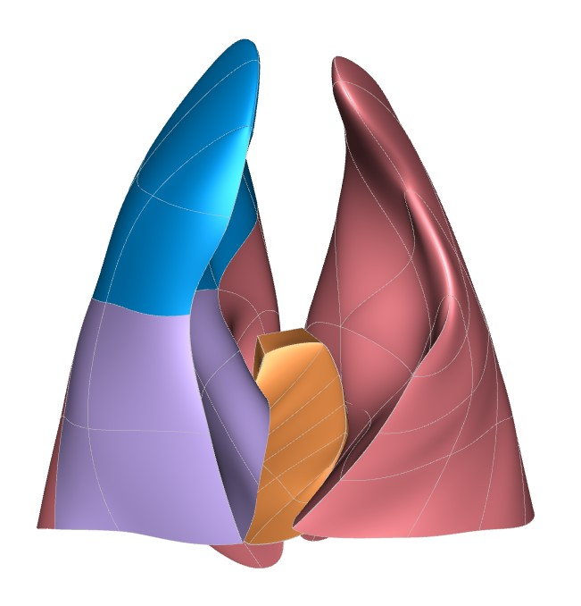

In this workspace we have the `Scaffold Maker <https://github.com/ABI-Software/scaffoldmaker>`_ workflow and configuration files needed to produce the pig lung scaffold for the `SPARC <https://commonfund.nih.gov/sparc>`_ project. 

The pig lung scaffold was independently designed based on generic anatomical structures containing different cube, wedge and tetrahedron elements. As the anatomical structure of the lungs varies in each species, the lung scaffolds are capable of representing the characteristics of an individual lung in various species accurately. For instance, the lung scaffolds were fitted and smoothed to the segmented datasets from a pig (Yik Ching Lee 1, Alys R Clark, Matthew K Fuld, Susan Haynes, Abhay A Divekar, Eric A Hoffman, Merryn H Tawhai (2013): “MDCT-based quantification of porcine pulmonary arterial morphometry and self-similarity of arterial branching geometry". University of Iowa). These scaffolds can also be used to register and map various data such as neural network, blood vessel, ventilation, etc.

Please see the `SPARC Portal <https://sparc.science>`_ for more details about the SPARC project.
