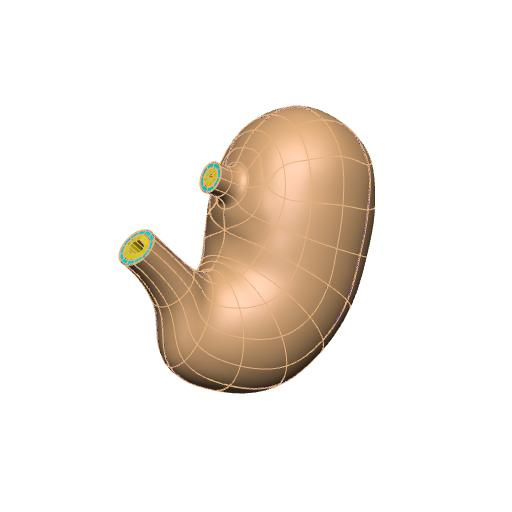

In this workspace we have the `Scaffold Maker <https://github.com/ABI-Software/scaffoldmaker>`_ workflow and configuration files needed to produce the generic pig stomach scaffold for the `SPARC <https://commonfund.nih.gov/sparc>`_ project. 

An anatomically-based 3D scaffold of the pig stomach is created to map nerve ending pathways. The stomach scaffold is generated with a configurable central path defined from the fundus apex to the duodenum. A user can annotate the fundus, body, antrum, pylorus, and duodenum along the central path and use that to define the respective regions of the stomach. The cross axes of the central path provide control of the major and minor radii of the stomach in different sections.

Four wall layers (mucosa, submucosa, circular muscle, and longitudinal muscle) are added to the pig stomach scaffold. The outer surface of the scaffold is annotated as the serosa.

Please see the `SPARC Portal <https://sparc.science>`_ for more details about the SPARC project.