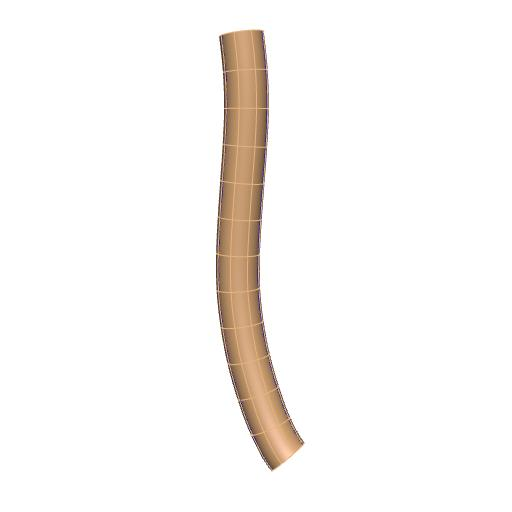

In this workspace we have the mapping tool provenance data file needed to produce the generic human esophagus scaffold for the `SPARC <https://commonfund.nih.gov/sparc>`_ project. The mapping tool will be accessible from the release download page on the `SPARC Portal <https://sparc.science>`_. 

An anatomically-based 3D scaffold of the human esophagus is created to fit in the entire gastrointestinal tract scaffold. The esophagus scaffold is generated with a configurable central path defined from the proximal end of the upper esophageal sphincter to the distal end of the lower esophageal sphincter. The cervical, thoracic, and abdominal part of the esophagus are annotated with their respective identifiers. The cross axes of the central path provide control of the major and minor radii along the length of the esophagus. The human esophagus scaffold is parameterised with literature data to represent the anatomy as accurate as possible.

Four wall layers (mucosa, submucosa, circular muscle, and longitudinal muscle) are added to the human esophagus scaffold. The outer surface of the scaffold is annotated as the serosa.

Please see the `SPARC Portal <https://sparc.science>`_ for more details about the SPARC project.